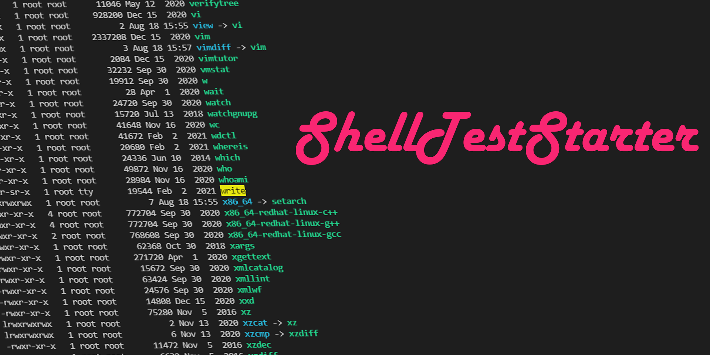

Starter kit for testing shell scripts.  
You can easily create stub commands and commands that can receive here documents.

# Quick Start

First, go to `sample` and run `setup.sh`

```
[root@<containerid> workdir]# cd sample/
[root@<containerid> sample]# ./setup.sh
INFO: prepare stub script
gcc -o template_communicate_stub template_communicate_stub.c
done prepare!
```

Run `test_sample_backup_script.sh` to complete the test

```
[root@<containerid> sample]# ./test_sample_backup_script.sh
begin sample backup script test
OK: test case 1
OK: test case 2
OK: test case 3
OK: test case 4
OK: test case 5
OK: test case 6
OK: test case 7
OK: test case 8
OK: test case 9
complete database backup test
```

After the test is complete, run `setup.sh clean` to clean the directory

```
[root@<containerid> sample]# ./setup.sh clean
INFO: clean all scripts generated by this script
INFO: remove sqlplus
INFO: remove sqlplus.dat
INFO: remove rman
INFO: remove rman.dat
INFO: remove db_check.sh
INFO: remove db_check.dat
INFO: all done!
```

# Usage

modify `sample/setup.sh` to generate the required stub commands.  
when executing the test shell, execute the following in the initialization process to start the stub.

```
export PATH=./:$PATH
```

In the test shell, the success or failure of the test is determined by judging the return value of the command executed by the target script and the log output when added.

- return value

```
./sample_backup_script.sh
ret=$?
if [ $ret -eq 0 ]; then
    echo "OK: test case 1"
else
    echo "NG: test case 1 : [ret : ${ret}]"
fi
```

- log keyword

```
./sample_backup_script.sh
ret=$(tail -n 1 $logname | grep "INFO: complete database backup" | wc -l)
if [ $ret -eq 1 ]; then
    echo "OK: test case 2"
else
    echo "NG: test case 2"
fi
```

# Requires

- Docker Engine or Linux OS

This starter only works on Linux  
We have confirmed the operation on CentOS7.  
It has not been confirmed to work with other distributions, but I think it will probably work.

# Command Tips

## start continer

### simply

```
docker-compose up
docker-compose run c_dev_env /bin/bash
```

### when connecting to a started container

```
docker exec -it "$(docker ps -qf "name=c_dev_env")" /bin/bash
```

## stop continer

- simply

```
docker-compose down
```

- when you want to completely erase the image

```
docker-compose down --rmi all
```

# Author


**tokku5552**

Engineering Manager in Tokyo Japan.  
Flutter/Next.js/Node.js/python/RHEL/Oracle/AWS/Docker

- [Twitter](https://twitter.com/tokkuu) / [Facebook](https://www.facebook.com/tokkuatggrks)
- [LinkedIn](https://www.linkedin.com/in/shinnosuke-tokuda-853b78207/) / [Wantedly](https://www.wantedly.com/id/shinnosuke_tokuda)

# License

Copyright (c) 2021 tokku5552  
This software is released under the MIT License.  
https://opensource.org/licenses/mit-license.php
